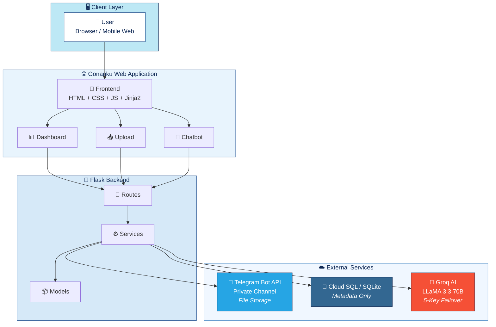
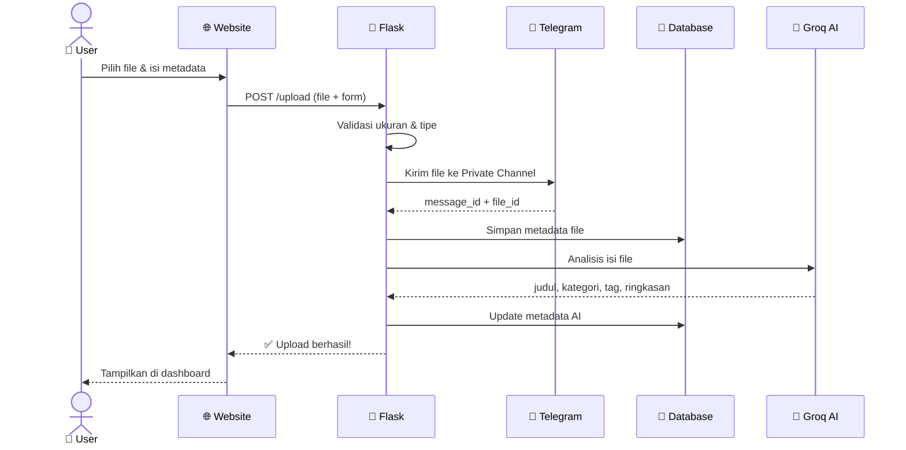
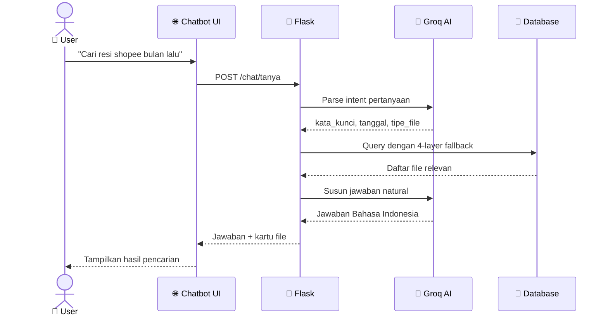
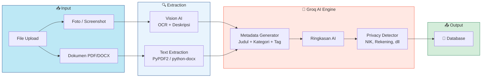
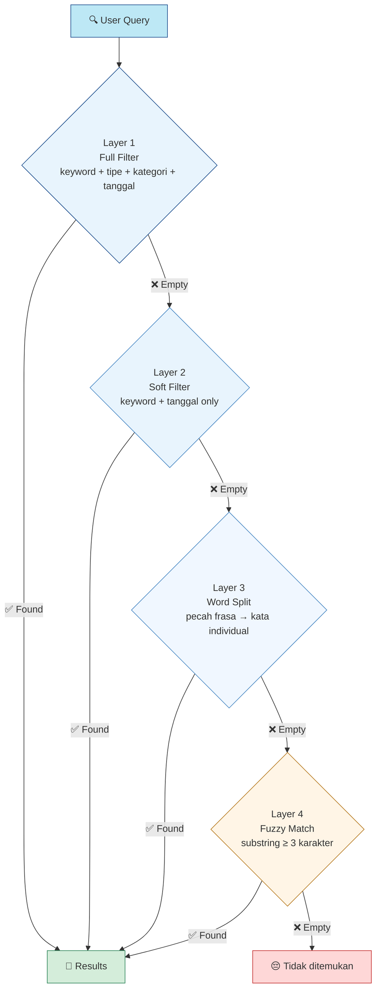
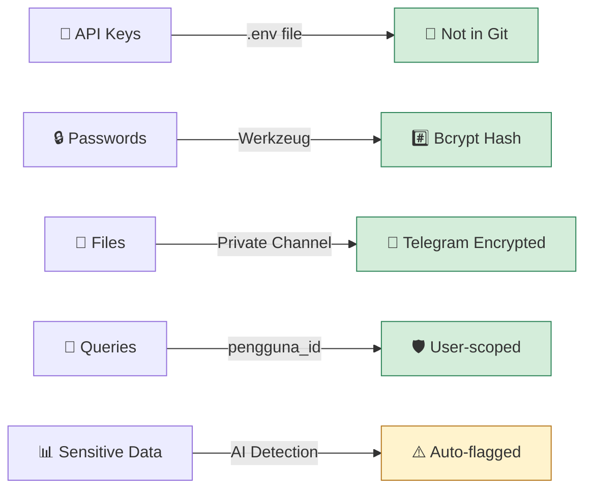
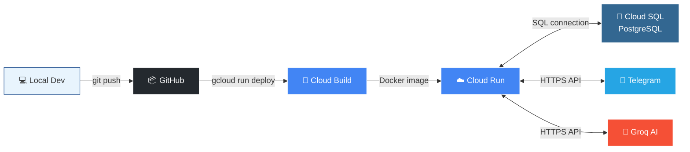

<p align="center">
  
</p>

<h1 align="center">☁️ Gonanku — Personal AI Memory Vault</h1>

<p align="center">
  <a href="https://git.io/typing-svg">
    
  </a>
</p>

<p align="center">
  
  
  
  
  
  
</p>

<p align="center">
  
  
  
  
  
</p>

<p align="center">
  <a href="#-tentang-proyek">Tentang</a> •
  <a href="#-arsitektur-sistem">Arsitektur</a> •
  <a href="#-alur-kerja">Alur Kerja</a> •
  <a href="#-fitur-utama">Fitur</a> •
  <a href="#%EF%B8%8F-tech-stack">Stack</a> •
  <a href="#-cara-menjalankan">Instalasi</a> •
  <a href="#-identitas-mahasiswa">Identitas</a>
</p>

---

## 📋 Tentang Proyek

> **Gonanku** adalah aplikasi web arsip pribadi cerdas yang dibangun sebagai **Tugas Besar Mata Kuliah Komputasi Awan** di Telkom University Surabaya.

Pernahkah Anda kehilangan file penting di antara ribuan foto di galeri, chat WhatsApp, folder download, atau flashdisk yang tercecer?

**Gonanku** hadir sebagai solusi — sebuah *personal memory vault* yang:
- 📤 Menyimpan file di **Telegram Private Channel** (gratis & unlimited)
- 🧠 Mengkatalogkan otomatis dengan **Groq AI** (judul, kategori, tag, ringkasan)
- 🔍 Memungkinkan pencarian dengan **chatbot AI** berbahasa Indonesia
- ☁️ Berjalan di **Google Cloud Platform** (Cloud Run + Cloud SQL)

### ❓ Mengapa Gonanku Berbeda?

| Masalah Umum | Solusi Gonanku |
|:---|:---|
| 📁 File tercecer di galeri, chat, email, flashdisk | ✅ Satu tempat terpusat untuk semua arsip |
| 🏷️ Nama file tidak jelas (`IMG_20250601_*.jpg`) | ✅ AI otomatis memberi judul deskriptif |
| 🔎 Sulit mencari file lama | ✅ Chatbot AI: *"cari resi shopee bulan lalu"* |
| 💸 Cloud storage mahal | ✅ Telegram = storage **gratis & unlimited** |
| 📊 Tidak tahu punya berapa file | ✅ Dashboard **16 metrik** real-time |

---

## 🏗️ Arsitektur Sistem



---

## 🔄 Alur Kerja

### 📤 Alur Upload File



### 🤖 Alur Chatbot



### 🧠 AI Processing Pipeline



---

## ✨ Fitur Utama

<table>
<tr>
<td width="50%">

### 📊 Dashboard Cerdas
- **16 metrik real-time** — total arsip, foto, video, dokumen, audio, screenshot, ukuran total, upload hari/bulan ini, status AI, file sensitif
- Grafik komposisi tipe file & kategori terbanyak
- File terbaru & log aktivitas terkini

</td>
<td width="50%">

### 📤 Upload Multi-File
- Drag & drop atau pilih file (maks 50 MB/file)
- Batch upload: 15 foto / 10 dokumen sekaligus
- Image cropper untuk foto profil
- File otomatis → Telegram private channel

</td>
</tr>
<tr>
<td width="50%">

### 🧠 AI-Powered Metadata
- **Auto-Title** — judul deskriptif dari isi file
- **Auto-Category** — 10+ kategori otomatis
- **Auto-Tag** — tag relevan untuk pencarian
- **Auto-Summary** — ringkasan isi dokumen
- **Privacy Detection** — deteksi NIK, rekening, dll
- **Vision/OCR** — baca teks dari foto
- **5 API key failover** — always-on

</td>
<td width="50%">

### 🤖 Chatbot Pencarian AI
- Natural language: *"cari resi shopee bulan lalu"*
- Intent parsing NLP Bahasa Indonesia
- **4-layer search fallback** → selalu dapat hasil
- **Relevance scoring** → hasil paling akurat di atas
- Pencarian di **8+ kolom** termasuk OCR text

</td>
</tr>
<tr>
<td width="50%">

### 🗂️ Manajemen Arsip
- CRUD file, kategori, dan tag
- Soft delete & restore
- Filter tipe, kategori, tanggal, privasi
- Regenerate AI metadata kapan saja
- Activity log & audit trail

</td>
<td width="50%">

### 🎨 UI/UX Profesional
- Desain clean & personal
- 🌙 Dark / ☀️ Light mode
- Responsive mobile & desktop
- Micro-animations & transitions
- Font Plus Jakarta Sans

</td>
</tr>
</table>

### 🔁 Smart Search — 4-Layer Fallback



---

## 🛠️ Tech Stack

<table>
<tr>
<td align="center" width="96">
  
  <br><strong>Python</strong>
</td>
<td align="center" width="96">
  
  <br><strong>Flask</strong>
</td>
<td align="center" width="96">
  
  <br><strong>Cloud SQL</strong>
</td>
<td align="center" width="96">
  
  <br><strong>SQLite</strong>
</td>
<td align="center" width="96">
  
  <br><strong>HTML5</strong>
</td>
<td align="center" width="96">
  
  <br><strong>CSS3</strong>
</td>
<td align="center" width="96">
  
  <br><strong>JavaScript</strong>
</td>
<td align="center" width="96">
  
  <br><strong>Docker</strong>
</td>
</tr>
<tr>
<td align="center" width="96">
  
  <br><strong>GCP</strong>
</td>
<td align="center" width="96">
  
  <br><strong>Git</strong>
</td>
<td align="center" width="96">
  
  <br><strong>Telegram</strong>
</td>
<td align="center" width="96">
  
  <br><strong>Groq AI</strong>
</td>
<td align="center" width="96" colspan="4">
</td>
</tr>
</table>

<details>
<summary><strong>📦 Detail Stack Lengkap (klik untuk membuka)</strong></summary>

| Layer | Teknologi | Fungsi |
|:------|:----------|:-------|
| **Frontend** | HTML, CSS, JavaScript, Jinja2 | UI/UX responsif dan interaktif |
| **Backend** | Python Flask | REST API & server-side rendering |
| **Database** | Cloud SQL (PostgreSQL) / SQLite | Metadata file & user data |
| **AI Engine** | Groq API (LLaMA 3.3 70B) | Metadata otomatis, chatbot, OCR |
| **Vision AI** | Groq Vision (LLaMA 4 Scout) | Membaca teks dari gambar |
| **File Storage** | Telegram Bot API (Private Channel) | Penyimpanan file gratis & unlimited |
| **Deployment** | Google Cloud Run | Serverless container hosting |
| **Container** | Docker | Reproducible environment |
| **Migration** | Flask-Migrate (Alembic) | Database version control |
| **Auth** | Flask-Login + Werkzeug | Session auth + password hashing |

</details>

---

## 🚀 Cara Menjalankan

<details>
<summary><strong>📋 Prasyarat</strong></summary>

- Python 3.11+
- Git
- Akun Telegram (untuk bot & private channel)
- API Key Groq (gratis di [console.groq.com](https://console.groq.com))

</details>

### 1️⃣ Clone & Setup

```bash
git clone https://github.com/Sulthonikamalm/cloudtubes-gonanku.git
cd cloudtubes-gonanku
python -m venv venv
venv\Scripts\activate          # Windows
# source venv/bin/activate     # Linux/Mac
pip install -r requirements.txt
```

### 2️⃣ Konfigurasi

```bash
cp .env.example .env
```

Edit `.env` — isi minimal:

```env
TELEGRAM_BOT_TOKEN=your_bot_token_here
TELEGRAM_CHAT_ID=your_private_channel_id
GROQ_API_KEY=your_groq_api_key
```

### 3️⃣ Jalankan

```bash
flask db upgrade
flask buat-pengguna email@example.com username password
flask run
```

Buka 👉 **http://localhost:5000** 🎉

---

## 📁 Struktur Proyek

<details>
<summary><strong>🗂️ Lihat pohon direktori lengkap</strong></summary>

```
cloudtubes-gonanku/
├── 📄 run.py                       # Entry point
├── 📄 Dockerfile                   # Container config
├── 📄 requirements.txt             # Dependencies
├── 📄 .env.example                 # Env template
│
├── 📂 app/
│   ├── __init__.py                 # App factory
│   ├── config.py                   # Environment config
│   ├── extensions.py               # SQLAlchemy, LoginManager
│   │
│   ├── 📂 models/                  # Database ORM
│   │   ├── pengguna.py             #   👤 User
│   │   ├── berkas.py               #   📄 File metadata
│   │   ├── kategori.py             #   📂 Category
│   │   ├── tag.py                  #   🏷️ Tag
│   │   ├── riwayat_chat.py         #   💬 Chat history
│   │   └── log_aktivitas.py        #   📋 Activity log
│   │
│   ├── 📂 routes/                  # HTTP handlers
│   │   ├── auth_routes.py          #   🔐 Login, logout, profil
│   │   ├── dashboard_routes.py     #   📊 Dashboard & metrik
│   │   ├── berkas_routes.py        #   📄 CRUD file/arsip
│   │   └── chat_routes.py          #   🤖 Chatbot API
│   │
│   ├── 📂 services/                # Business logic
│   │   ├── layanan_groq.py         #   🧠 Groq AI (5-key failover)
│   │   ├── layanan_telegram.py     #   📱 Telegram Bot API
│   │   ├── layanan_chatbot.py      #   🤖 Chatbot engine
│   │   ├── layanan_pencarian.py    #   🔍 Smart search (4-layer)
│   │   ├── layanan_upload.py       #   📤 Upload pipeline
│   │   └── layanan_log.py          #   📋 Activity logging
│   │
│   ├── 📂 templates/               # Jinja2 HTML
│   ├── 📂 static/                  # CSS, JS, images
│   └── 📂 utils/                   # Helpers
│
├── 📂 migrations/                  # Alembic migrations
└── 📂 docs/                        # Documentation
```

</details>

---

## 🔐 Keamanan



---

## ☁️ Deployment (Google Cloud)



```bash
gcloud run deploy gonanku \
  --source . \
  --region asia-southeast2 \
  --allow-unauthenticated \
  --set-env-vars "DATABASE_URL=postgresql://..." \
  --min-instances 0 \
  --max-instances 2 \
  --memory 512Mi
```

---

## 👨‍🎓 Identitas Mahasiswa

<table>
  <tr>
    <td align="center" rowspan="6" width="160">
      <br/><br/>
      
    </td>
    <td><strong>👤 Nama</strong></td>
    <td>Sulthonika Mahfudz Al Mujahidin</td>
  </tr>
  <tr>
    <td><strong>🆔 NIM</strong></td>
    <td><code>1202230023</code></td>
  </tr>
  <tr>
    <td><strong>🎓 Program Studi</strong></td>
    <td>S1 Teknologi Informasi</td>
  </tr>
  <tr>
    <td><strong>🏫 Universitas</strong></td>
    <td>Telkom University Surabaya</td>
  </tr>
  <tr>
    <td><strong>📚 Mata Kuliah</strong></td>
    <td>Komputasi Awan (Cloud Computing)</td>
  </tr>
  <tr>
    <td><strong>📅 Semester</strong></td>
    <td>6 — Genap 2025/2026</td>
  </tr>
</table>

---

## 📄 Lisensi

Proyek ini dibuat untuk keperluan akademik sebagai **Tugas Besar** mata kuliah **Komputasi Awan** di **Telkom University Surabaya**.

---

<p align="center">
  
</p>

<p align="center">
  Dibuat dengan ❤️ dan ☕ di Surabaya
</p>
